# Rolling update sticky sessions with Wercker

## Deploy the rolling update sticky sessions service

### Clone the repository

<pre>
mkdir docker-images
git clone git@github.com:oracle/docker-images.git docker-images
cd docker-images/ContainerCloud
</pre>

### Login to Docker Hub
You will be building Docker images and pushing them to Docker Hub. In order to push to Docker Hub, you will need to authenticate with Docker Hub. Open a terminal and login to Docker Hub with this command:

<pre>
docker login
</pre>

You will then be prompted for your username and password. Enter your Docker Hub account name (which is NOT your email address). You can find this by logging in to Docker Hub in a Web browser and finding the name next to your avatar in the top navigation of the Docker Hub Web site.

<pre>
Login with your Docker ID to push and pull images from Docker Hub. If you don't have a Docker ID, head over to https://hub.docker.com to create one.
Username:
Password:
Login Succeeded
</pre>

### Configure the Builder to Use Your Docker Hub Account

Before you can build your first stack, open [images/build/vars.mk](images/build/vars.mk) and set the registry name variable as your Docker Hub account (usernames should be entered in lower case):

<pre>
REGISTRY_NAME ?= your_docker_hub_username
</pre>

### Build the image

Build the `rolling-router-sticky-sessions`image using make:

<pre>
cd images/rolling-router-sticky-sessions
make
</pre>

This will upload the image to your Docker-hub.

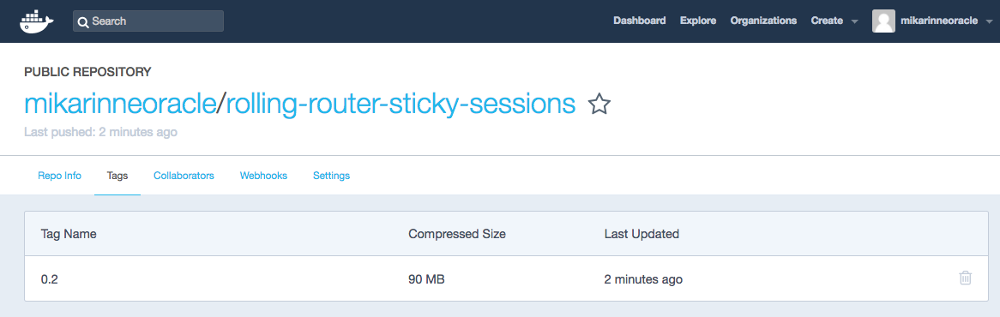

### Create the OCCS service

Login to OCCS and create a new service `rolling-router-sticky` with the following YML where the image repository refers to your Docker-hub account (bolded): 

<pre>
version: 2
services:
  rolling-router-sticky:
    image: '<b>mikarinneoracle</b>/rolling-router-sticky-sessions:0.2'
    environment:
      - 'OCCS_API_TOKEN={{api_token}}'
      - KV_IP=172.17.0.1
      - KV_PORT=9109
      - APP_NAME=docker-hello-world
      - 'occs:availability=per-pool'
      - 'occs:scheduler=random'
    ports:
      - '80:80/tcp'
      - '8080:8080/tcp'
</pre>

If you haven't build the image of your own, you can use the YML above as is.

Deploy the service.

## Deploy the rolling router sticky sessions keyvalues with the GUI

Check the worker host `public_ip` from the OCCS admin:

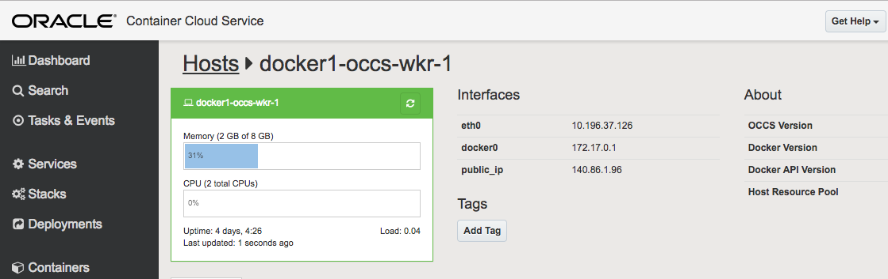

Check also the `API token` a.k.a Bearer from Settings/My Account:

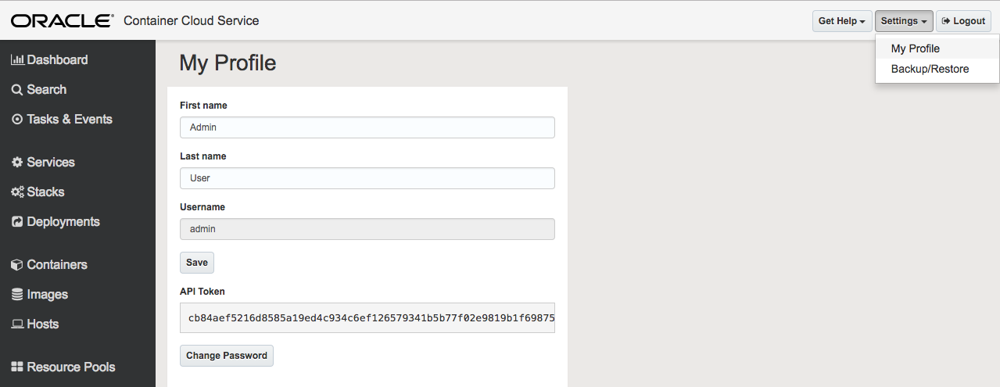

From your browser open the URL pointing to the worker host public_ip address e.g. `http://140.86.1.96:8080`.

The rolling router sticky sessions GUI should show up with a setup screen.

Enter the OCCS admin host ip, API Token (Bearer), Application name `docker-hello-world` and the preferred `host port` of the Docker application e.g. 3000:

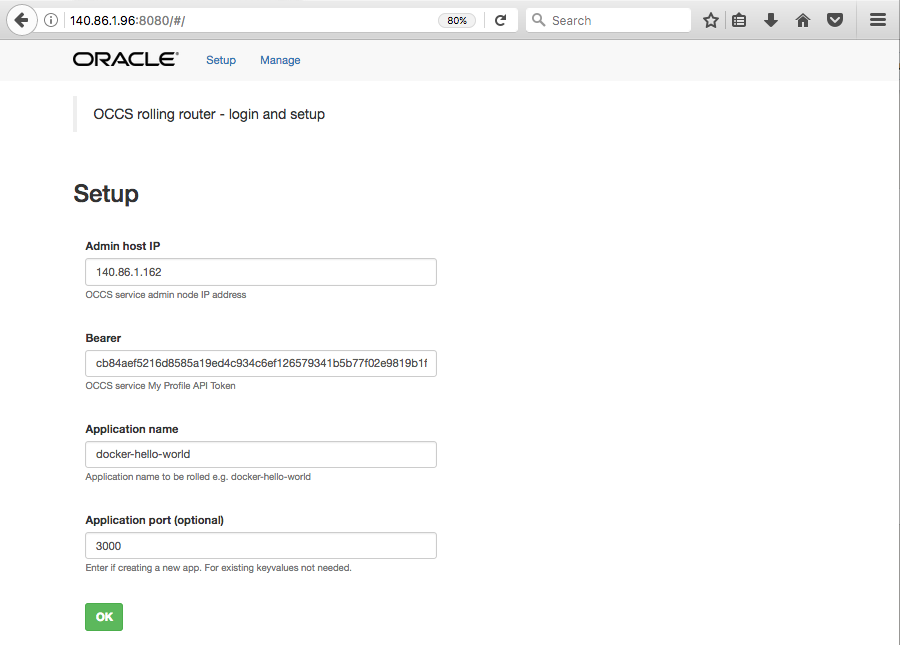

Press OK. The following screen should show up if the login with given OCCS admin IP and API token was succesful:

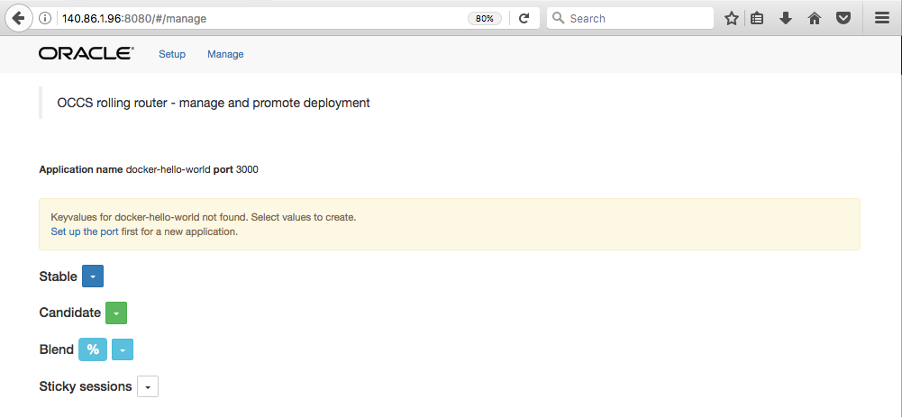

Let's create the initial keyvalues for the hello world application deployment by selecting the following values from the dropdowns:

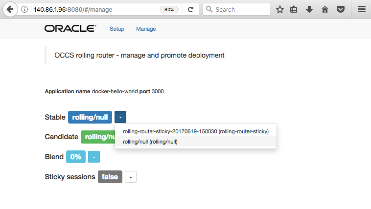

Set the values like this:

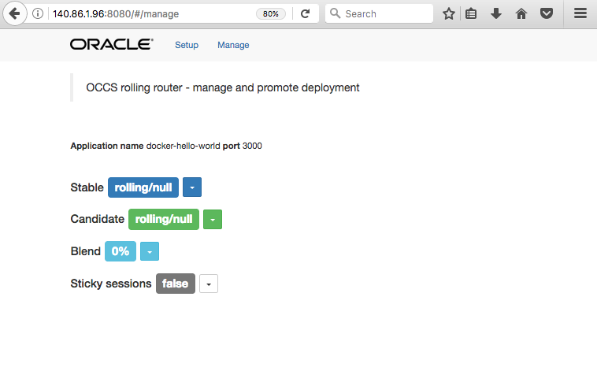

This will store the values in OCCS keyvalues for the hello world application in host port 3000:

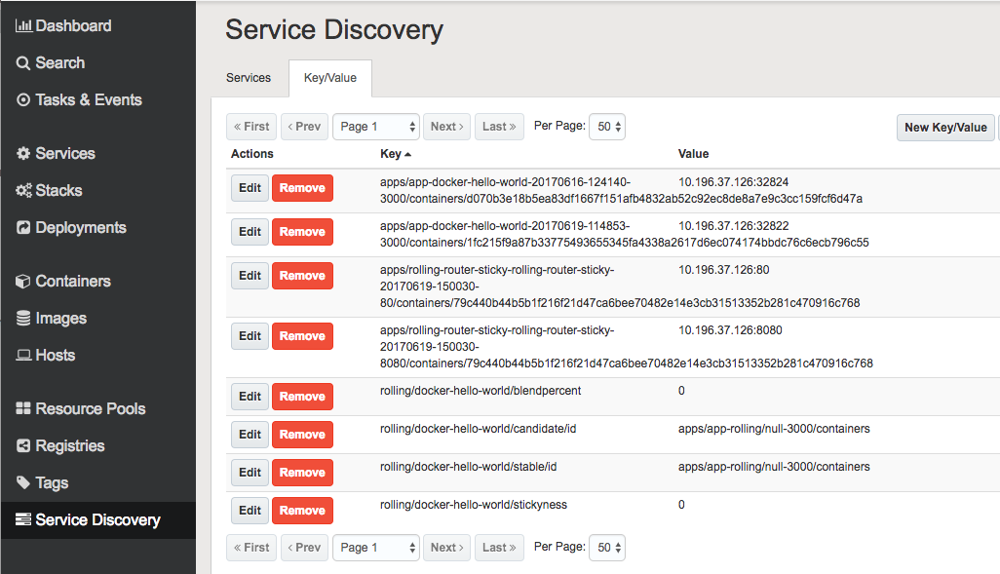

## Setting up Wercker CI/CD

### Building the hello world application base box image for Wercker

Since the rolling router sticky sessions Wercker CI/CD script for OCCS uses utilities like `jq`, `recode` and `curl` we have selected `Ubuntu`as the base image for our hello world `Node.js` application. 

#### Build Ubunty with Node.js and required utilities

First build Ubuntu image with the utilities included from `scratch` and then using the built Ubuntu image build the actual hello world appliucation image for the rolling router sticky sessions deployment.

Here's the <a href="https://github.com/mikarinneoracle/docker-brew-ubuntu-core/blob/dist/trusty/Dockerfile#L50">Dockerfile</a> for the forked Ubuntu project with the following additions to enable the utilities along with Node.js in the Ubuntu image:

<pre>
RUN sudo apt-get -y install libc-dev-bin libc6 libc6-dev
RUN sudo apt-get install -y recode
RUN sudo apt-get install -y jq
RUN sudo apt-get install -y curl
RUN sudo curl -sL https://deb.nodesource.com/setup_7.x | sudo -E bash -
RUN sudo apt-get install -y nodejs
RUN sudo apt-get install -y build-essential
</pre>

You can clone the project and build the image and push it Docker hub (change the repository bolded to match your Docker hub account) using the branch `dist` and the version `trusty`:

<pre>
mkdir ubuntu
git clone git@github.com:mikarinneoracle/docker-brew-ubuntu-core.git ubuntu
cd ubuntu
git checkout dist
cd trusty
export tag=$(docker build -t ubuntu . | grep 'Successfully built' | tail -c 13)
docker tag $tag <b>mikarinneoracle</b>/ubuntu:trusty
docker push mikarinneoracle/ubuntu
</pre>

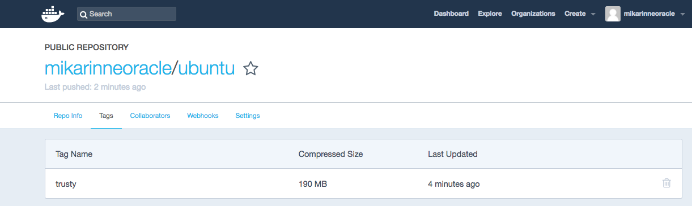

#### Build the Hello World application image

Using the custom built Ubunty image build the Node.js Hello world application. 
The <a href="https://github.com/mikarinneoracle/hello-world">source code</a> includes a Dockerfile with the following:

<pre>
FROM mikarinneoracle/ubuntu:trusty

# Create app directory; same as Wercker default
RUN mkdir -p /pipeline/source
WORKDIR /pipeline/source

# Install app dependencies
COPY package.json /pipeline/source/
RUN npm install

# Bundle app source
COPY . /pipeline/source/

EXPOSE 3000
CMD [ "npm", "start" ]
</pre>

You can clone the project and then build and push the image to Docker hub (change the repository bolded to match your Docker hub account):

<pre>
mkdir hello-world
git clone git@github.com:mikarinneoracle/hello-world.git hello-world
cd hello-world
export tag=$(docker build -t hello-world . | grep 'Successfully built' | tail -c 13)
docker tag $tag <b>mikarinneoracle</b>/hello-world:latest
docker push mikarinneoracle/hello-world
</pre>

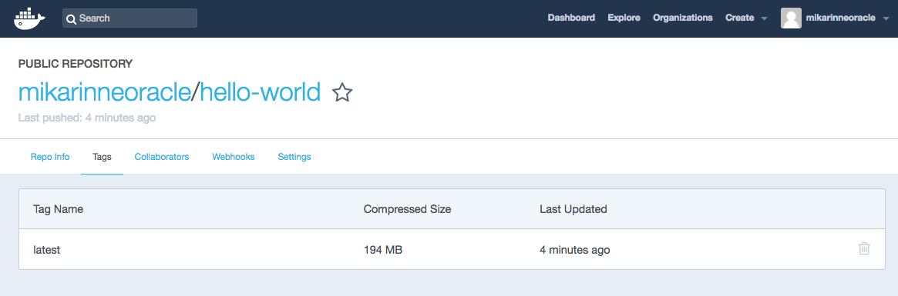

### Creating the Wercker workflow 

Login to your Wercker account and create a Wercker `application` Hello World for the Node.js application that we just built.

Then create a Wercker `workflow` with two steps `build` (the default) and `deploy`.

Add a new `step` deploy:

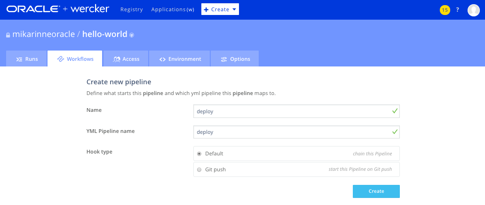

Add it to the workflow after the build step:

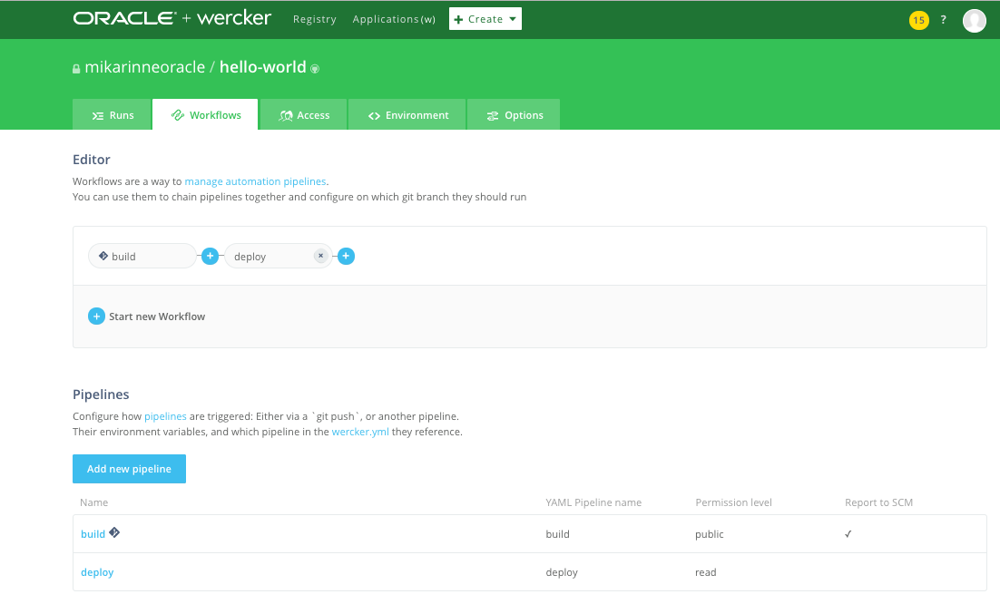

The YML pipeline names are identical to pipeline names.

### Creating Wercker global enviroment values for the Workflow

Create the following application environment values for the Wercker workflow:

<pre>
  SERVICE_MANAGER:    OCCS admin url e.g. https://140.86.1.162
  API_TOKEN:          OCCS API token (bearer)
  APP_NAME:           docker-hello-world 
  APP_FRIENDLY_NAME:  Hello-world  
  DOCKER_EMAIL:       Docker hub account email
  DOCKER_USERNAME:    Docker hub account username
  DOCKER_PASSWORD:    Docker hub account password
  DOCKER_REGISTRY:    Docker hub registry; typically the same as the username e.g. mikarinneoracle 
  EXPOSED_PORT:       Hello world application host port e.g. 3000
  IMAGE_NAME:         Wercker.yml box name e.g. hello-world
  APP_TAG:            Wercker.yml box tag e.g. latest
  SCALE_AMOUNT:       OCCS scale amount e.g. 1
  DOCKER_CMD:         OCCS image command e.g. npm start (for Node.js) 
</pre>

### Launch the first build with the workflow

After setting the application environment variables you can start the first build by clicking the ` trigger a build now` link as below:

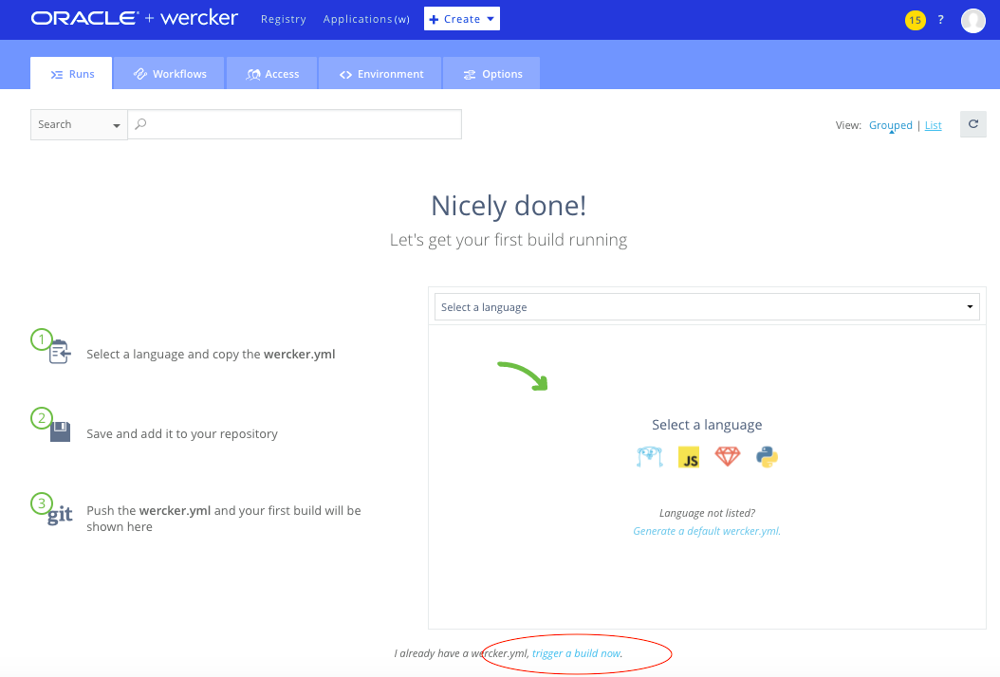

Workflow starts and runs the workflow:

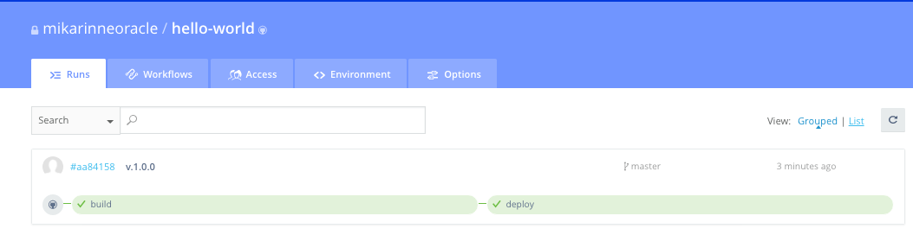

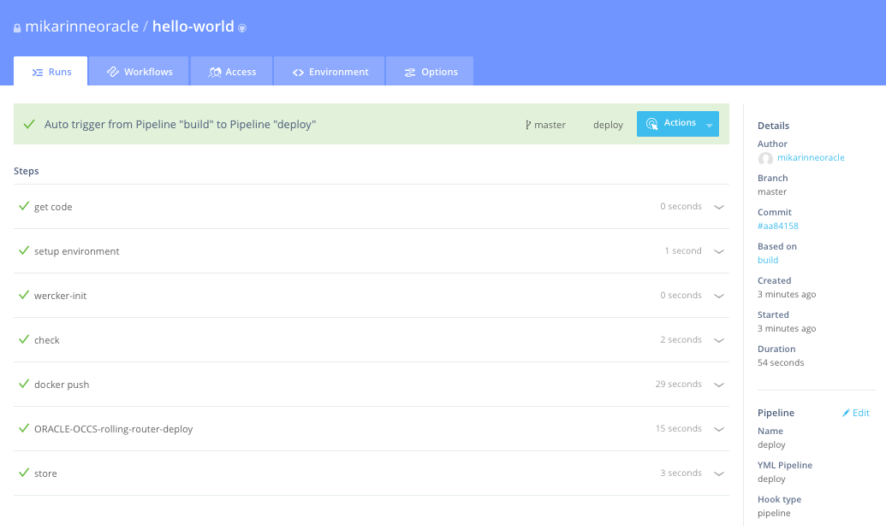

Hello world application candidate image with a `timestamp` tag (i.e. the Wercker environment variable `$WERCKER_MAIN_PIPELINE_STARTED` in the deploy script) was created and pushed to Docker hub:

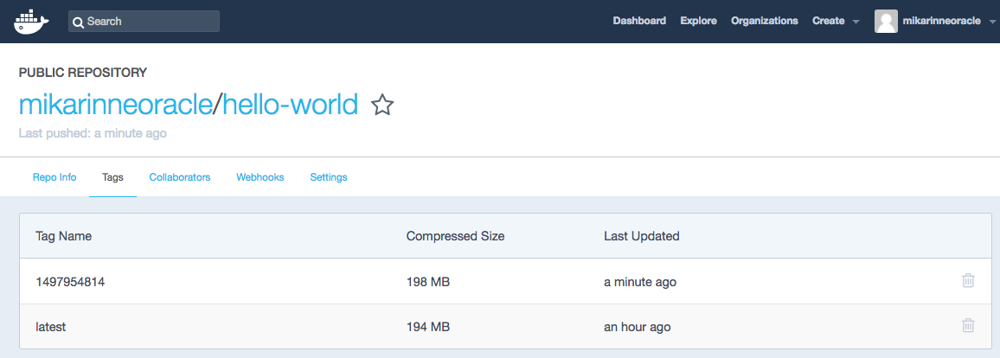

The new image was also deployed to OCCS and the candidate image of the Hello world application should be running:

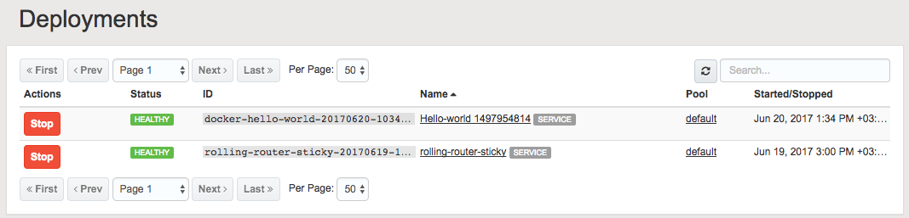

The Rolling router sticky sessions GUI was updated to reflect the keyvalue change in OCCS for the application candidate:

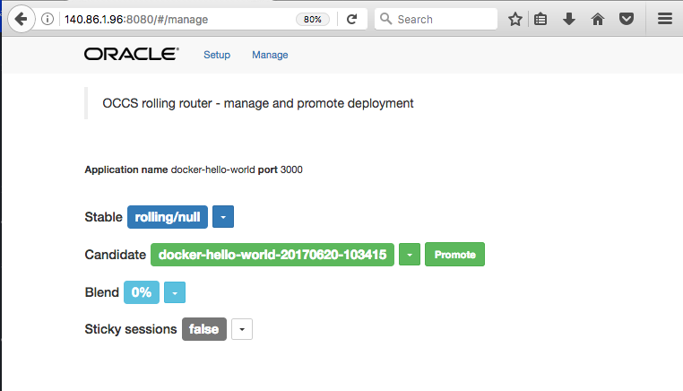

### Promoting the candidate image and calling the stable application from browser

Promote the candidate to `stable`by clicking promote button in the Rolling router sticky sessions GUI. The result should be that the stable version is now the image that was just built by Wercker and the candidate is rolling/null:

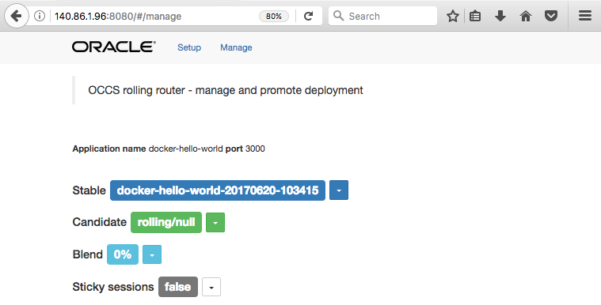

Now you can open a new tab to your browser and call the stable version of application by opening the URL pointing to the worker host public_ip address e.g. `http://140.86.1.96`.

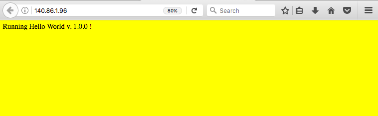

(The backgroud color and text can be slightly different)

### Building a new candidate

Make a chance to the Hello world `index.html` with a an editor like changing the background color to green and version to 1.0.1. Commit the change and push the change to the repository:

<pre>
git add index.html
git commit -m 'v.1.0.1'
git push origin master
</pre>

Wercker should pick up this change automatically and the workflow starts for a new candidate verision of Hello world.

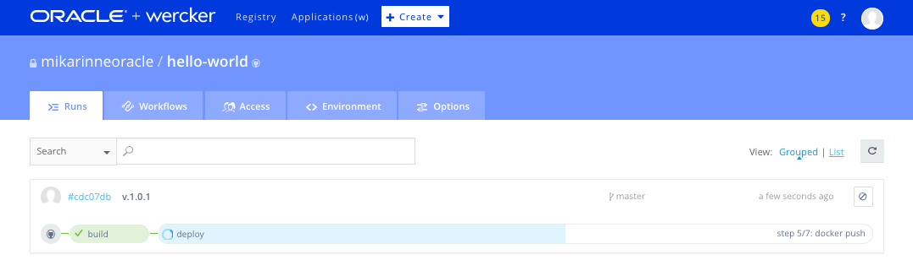

A new candidate image with a new tag should be uploaded to Docker hub:

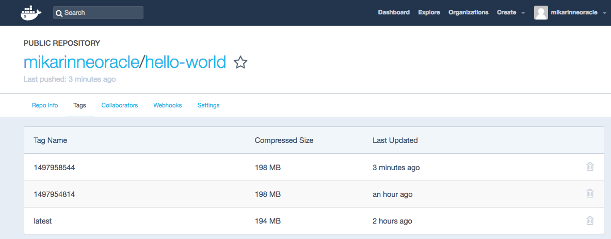

It should be also deployed and started in OCCS now both the stable and candidate running:

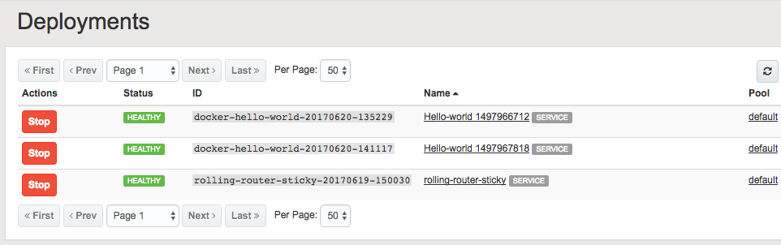

The rolling router sticky sessions GUI should now be updated with the candidate to reflect the change in the OCCS keyvalue for the application candidate:

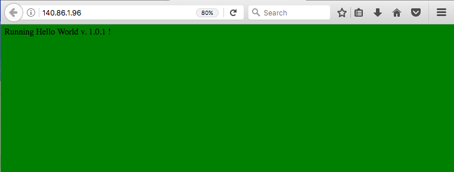

